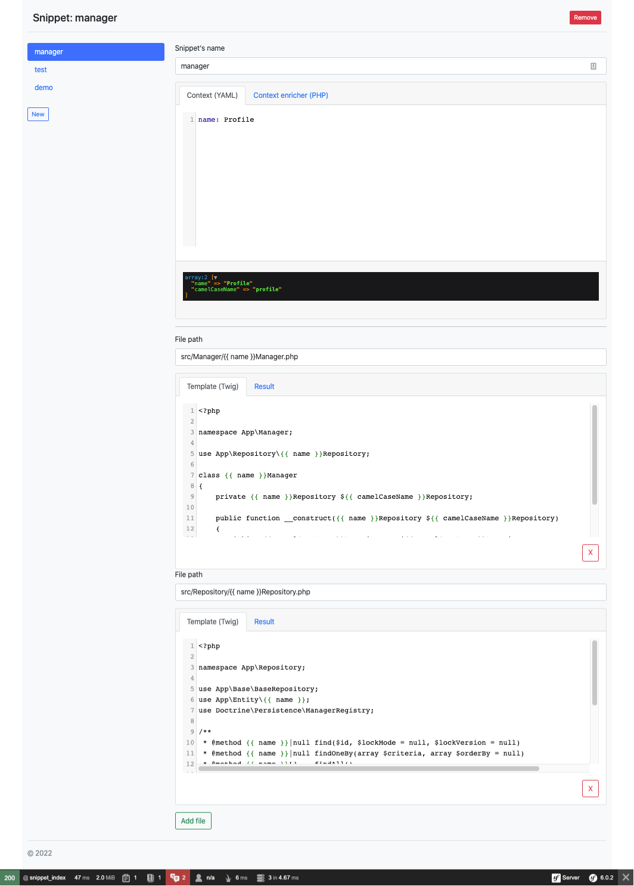
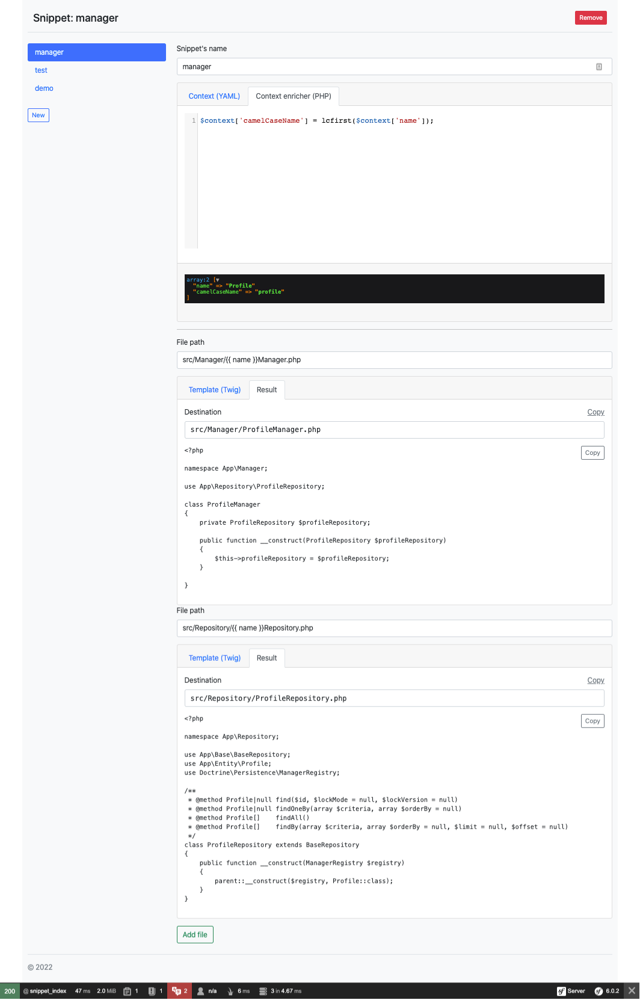
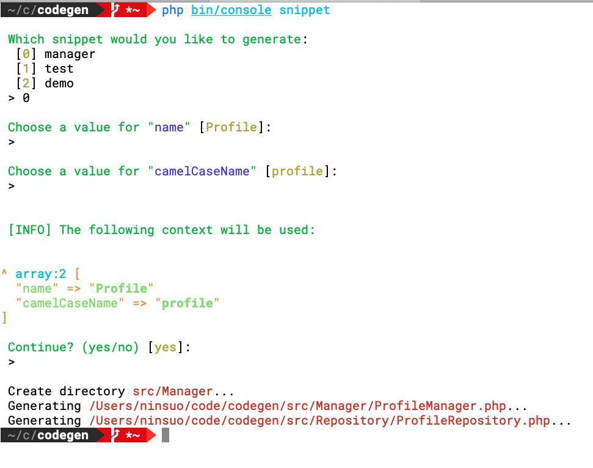
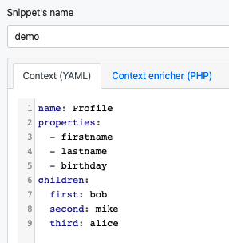
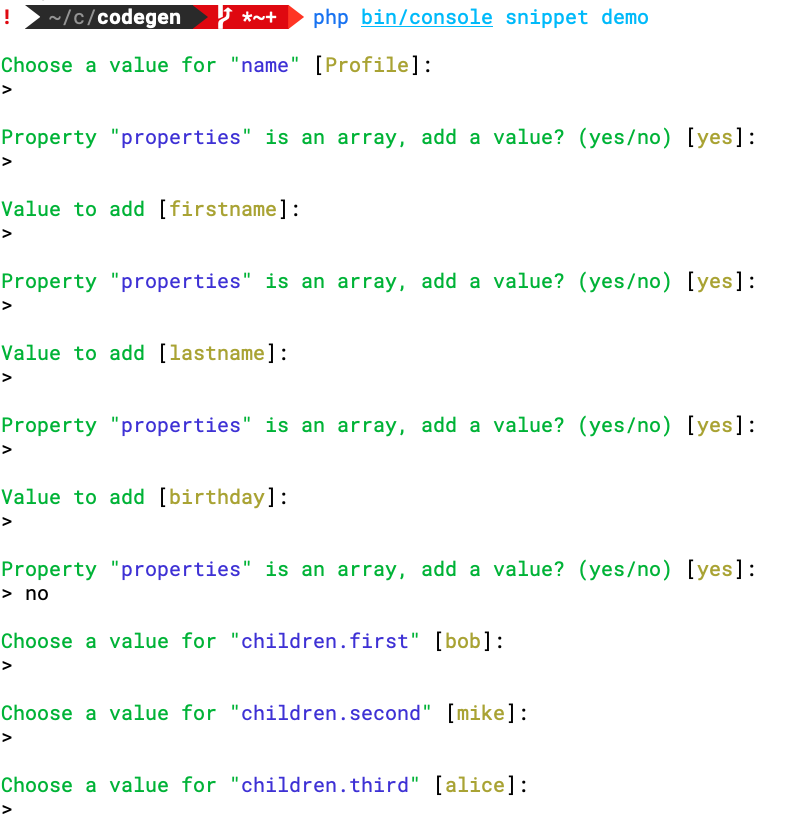

# Yet another code generator ?

This bundle provides a code generator that should be used in development environment.

Code is generated using the provided YAML context and twig templates.

To add more flexibility, it is possible to enrich the context using PHP.

Finally, a command-line tool helps automatically generating files at the right location.

The command is smart enough to handle complex contexts:

[Back](../README.md)